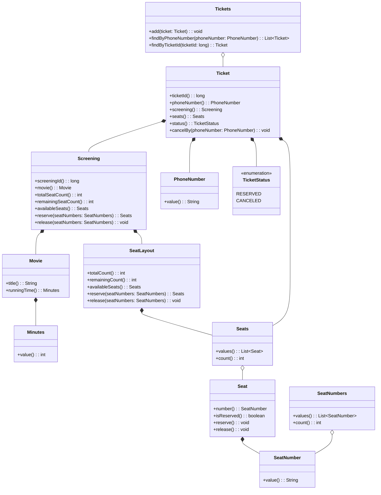

# Domain UML

## Notes

- `Screen` 대신 실제 예매 대상인 `Screening`을 도메인 중심 객체로 둔다.
- `Movie`는 제목과 상영 시간을 가지며, 상영 시간은 `Minutes` 값 객체로 표현한다.
- `SeatLayout`은 특정 상영의 `Seats`를 관리하고, 실제 좌석 상태 변경은 각 `Seat`를 통해 수행한다.
- `SeatNumber`는 좌석 번호를 표현하는 값 객체이며, 유효한 범위는 `A`부터 `F`까지로 제한한다.
- `SeatNumbers`는 예매 요청이나 취소 요청에 사용되는 좌석 번호 컬렉션이다.
- `remainingSeatCount()`는 별도 상태 저장값이 아니라 전체 좌석 수 또는 예매 가능 좌석 목록으로부터 계산되는 파생값으로 본다.
- `Ticket`은 예매 번호, 예매자 전화번호, 대상 상영, 예매 좌석, 예매 상태를 가진다.
- `Tickets`는 예매 컬렉션으로서 휴대폰 번호 조회와 예매 번호 조회 책임을 가진다.
